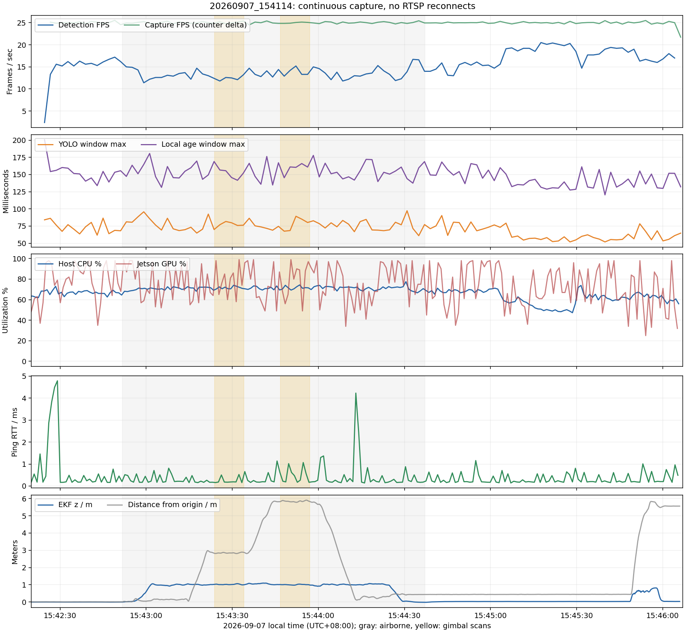

# 20260907_154114 飞行日志分析报告

分析日期：2026-09-07。依据为本次控制台、rosbag、主机/相机诊断、运行环境和源码快照；没有实时操作飞控或相机。

## 1. 结论

**本次没有重现上一轮 RTSP 黑屏/超时问题。** 从 15:42:24 首个合格帧到 15:46:06 退出，约 3 分 42 秒内只有一代采集连接，持续采集约 25 FPS；没有 RTSP 超时、HEVC 缺参考帧错误、重连或云台 UDP 应答超时。两航点扫描、返航、降落和解除解锁均有日志证据。

当前剩下的主要问题是：

1. **识别速度未达到 30 FPS。** 全部有帧统计的中位数为 15.0 FPS，空中阶段为 13.3 FPS；相机采集仍约 25 FPS。这更符合当前模型和整机并行负载下的处理速度限制，不能把“不是 30 FPS”当成本次又断流。
2. **返航到点不等于精确落回原点。** EKF 估计的返航到点水平残差约 0.12 m，接地时约 0.43 m；两者之间又变化约 0.31 m，需要与视频或外部位置参照区分实际位移和估计漂移。
3. **新增日志已有效工作，但有记录缺口。** 内核读取权限不足；Jetson 没有有效 GPU 频率/功耗字段；ROS 参数转储早于检测节点启动；任务 CSV 漏归档；rosbag 摘要被中断。CSV 已核对恢复，并修复了造成漏归档的脚本判断。

本次没有真正触发 watchdog 重连，所以它证明了新代码能够在当前配置下连续工作，**不能用来宣称真实断流后的恢复速度已经实测通过，也不能仅凭一次不复现说相机/链路根因已消失。**

## 2. 本次实际配置和修复是否生效

[检测运行环境](../flight_logs/20260907_154114/detector_runtime_13723/manifest.json)记录：`/usr/bin/python3`、Python 3.8.10、OpenCV 5.0.0、Ultralytics 8.4.89、PyTorch 2.1.0a0 NVIDIA 构建、CUDA 11.4、TensorRT 8.5.2.2。

实际参数仍是 `yolo11s.engine` / 640 / conf 0.55，FFmpeg/TCP、H.265，推理上限 30 FPS、计算线程配置 2；打开/读流超时 5000/2500 ms，本地帧有效期 1000 ms，重连间隔 1 s。TF 卡自动录像和电脑识别视频保存均关闭。

实际运行的检测 PID 是 **13723**，采集子进程 PID 是 **13846**。运行环境里登记的六份源码哈希与对应快照全部匹配，且与分析时当前源码一致；确认使用了本仓库的新采集器和新诊断代码。模型记录了路径、大小、修改时间，没有模型文件哈希，因此不把这些元数据当作模型二进制完全一致的证明。

## 3. 视频与相机链路

| 指标 | 本次结果 | 解释 |
| --- | --- | --- |
| 首次连接 → 首个合格帧 | 15:42:22.561 → 15:42:24.035，约 1.474 s | 首次打开阶段，不是运行中断流 |
| 合格采集帧 | 5566 | 约 25 FPS |
| 完成识别帧 | 3394 | 按约 222 s 估算，整体约 15.3 FPS |
| 跳过采集帧 | 2172，约 39% | 最新帧模式中未送入推理的帧，**不是网络丢包** |
| 过期推理结果 | 0 | 没有结果因超过 1000 ms 本地年龄而丢弃 |
| 连接代次 / 重连 | generation=1 / 0 | 全程同一采集进程 |
| RTSP 超时 / 等待统计 | 0 / 0 | 无上一轮连续 Waiting/Stream timeout |
| HEVC 缺参考帧 / RPS 错误 | 0 / 0 | 无上一轮的大量解码异常 |
| 云台 0x0E 应答超时 | 0 | 两轮扫描均顺利完成软件握手 |
| CAP 最大值 | 133.07 ms | 来自各诊断窗口峰值，远低于 2500 ms 读流阈值 |
| YOLO 最大值 | 97.30 ms | 包含推理及结果回传阶段，不是 GPU 单独计时 |
| 本地 AGE 最大值 | 200.66 ms | 包含 read 等待和推理，不是端到端视频延迟 |

控制台共有 109 条有帧 STATS 和 110 条 DIAG（含退出汇总）。STATS 中位 CAP=37.7 ms、YOLO=44.0 ms、AGE=108.0 ms。首条 FPS=2.4 的统计窗口包含初始打开时间，不应视为一次中途卡死。表内最大值取 DIAG 窗口峰值，而不是仅取两秒一次的最后一帧。

与 `20260906_183832` 对照：OpenCV 超时从 **10 次变为 0**，重连从 **4 次变为 0**，HEVC 缺参考帧从 **344 条变为 0**。前次有帧 FPS 中位数 16.4 排除了黑屏等待窗口，两次负载也不完全相同，不适合仅比较它和本次 15.0 来判断整体体验或修复性能。

相机走 `eth0`，主机地址 `192.168.144.30`，相机 `192.168.144.25`：

- **286 条 ping 应答，序号 1–286 无缺口**；RTT 中位数 0.203 ms、P95 1.01 ms、最大 4.79 ms。ping 在退出时被 SIGTERM 停止，没有最终汇总；这里的结论是记录中未见缺序号，不是对任意瞬时网络异常的绝对排除。
- 291 个主机样本中，`eth0` 都是 up / carrier=1 / 100 Mbps，RX/TX 错误与丢弃计数增量均为 0。
- 有流阶段 `eth0` 接收速率中位约 2.125 Mbps、最大约 2.579 Mbps，远未接近记录的 100 Mbps 端口速率；接口流量并非严格的相机独占流量。
- 51 次 TCP 快照中，39 次能看到已建立的视频连接，均为本地端口 55498 → 相机 8554；最大 Recv-Q=1684 B，Send-Q=0，没有持续的大量接收积压。启动前没有连接的快照属于正常情况。

这些数据共同支持**本次相机通信路径稳定**，没有证据需要继续增大读取超时。网卡计数和 ping 不能追溯说明前次为何异常，未抓码流也无法验收每一帧画面内容。

## 4. 为何还是达不到 30 FPS

| 阶段 | 识别 FPS 中位数 | 整机 CPU 中位数 | GPU 利用率中位数 |
| --- | ---: | ---: | ---: |
| 起飞前稳定取流，15:42:26–51 | 15.7 | 66.92% | 80% |
| 空中，15:42:51.625–15:44:37.134 | **13.3** | **71.19%** | **76%** |
| 航点 1 扫描 | 12.5 | 71.48% | 78.5% |
| 航点 2 扫描 | 13.3 | 71.54% | 84% |
| 接地后到结束 | 17.7 | 62.44% | 67% |

30 FPS 只是程序限频上限。采集本身约 25 FPS，且单次 YOLO/结果回传耗时中位 44 ms 已超过 30 FPS 对应的 33.3 ms 单帧预算，之后还有绘图、显示、调度等开销。空中识别速度降低时采集计数仍连续增加，支持“处理速度受限”的解释，而非“相机停止发图”。这组观察不是受控 A/B，不能精确拆出每个进程造成了多少 FPS 损失。

有流阶段总体 CPU 中位 68.96%、最大 77.53%；GPU 中位 75%、P95 98%、最大 99%。GPU 有明显高负载采样，但并非全程 100%。进程 CPU 按单核 100% 口径统计：

| 进程 | CPU 中位数，单核口径 | RSS 中位数 | 线程数 |
| --- | ---: | ---: | --- |
| 检测 PID 13723 | 37.97% | 3971 MiB | 6–7 |
| 采集 PID 13846 | 55.98% | 153 MiB | 17 |
| RViz PID 13726，在它存活的样本中 | 43.98% | 857 MiB | 21/26 |
| LIO PID 12809 | 44.95% | 64.9 MiB | 12–14 |
| rosbag record PID 12492 | 26.99% | 25.6 MiB | 17 |
| px4ctrl PID 13062 | 9.00% | 10.1 MiB | 5 |
| 新诊断采集器 PID 12279 | 8.00% | 13.4 MiB | 3 |

配置 `cpu_threads=2` 不等于 FFmpeg 只创建两个线程；17 个线程也不等于占用了 17 个核。诊断进程的单核 8% 约合 8 核整机容量的 1%，有开销但并非独占整机 8%。进程采样只覆盖选定进程及子进程，不应拿这张表代替全系统所有后台程序的归因。

有流阶段 RAM 最大约 7942/15502 MB，SWAP=0；全日志 MemAvailable 最低仍约 7315 MiB。总体 iowait 中位 0.13%、最大 0.38%，没有内存耗尽或持续磁盘等待饱和的证据。CPU 温度最高 61.25℃、GPU 59.41℃、tj 61.94℃。

**不能进一步断言没有降频或没有供电波动：** 本机 tegrastats 的 `GR3D_FREQ ...@[0]` 频率部分始终为 0，不能当成有效 GPU 工作频率；本次也没有 VDD/VIN/功耗字段。可用的是利用率和温度，不能把缺失字段解释成“功耗为零”。

RViz 在约 15:45:30 后正常退出，控制台虽显示红色 `REQUIRED process ... has died`，紧接着写明 `process has finished cleanly`，不是明确的崩溃证据。它只结束自己的可视化 launch，检测和其余记录继续。前后 FPS 并非单调改善，因此本报告没有据此宣称“关闭 RViz 就能解决性能问题”。

## 5. 飞行过程和定位情况

下表区分节点执行时刻和 rosbag 收到状态的时刻，均为北京时间：

| 时间 | 事件 |
| --- | --- |
| 15:42:51.446 | px4ctrl 进入 AUTO_TAKEOFF |
| 15:42:51.625 | bag 收到 armed=true / OFFBOARD，随后同批收到 IN_AIR |
| 15:43:01.588 | 转入 AUTO_HOVER |
| 15:43:12.726 | 发布航点 1：(3, 0, 1) |
| 15:43:21.802 | 航点 1 到达；节点记录距离 0.092 m、速度 0.130 m/s |
| 15:43:23.853–34.075 | 航点 1 云台扫描，约 10.222 s，无应答超时 |
| 15:43:34.079 | 发布航点 2：(5, 3, 1) |
| 15:43:44.752 | 航点 2 到达；节点记录距离 0.018 m、速度 0.107 m/s |
| 15:43:46.754–56.976 | 航点 2 云台扫描，约 10.222 s，无应答超时 |
| 15:43:57.926 | 发布返航目标：(0, 0, 1) |
| 15:44:13.702 | 返航到点；节点记录距离 0.116 m |
| 15:44:24.431 / .434 | 请求 LAND / 进入 AUTO_LAND |
| 15:44:36.625 | bag 收到 armed=false |
| 15:44:37.134 | bag 收到 ON_GROUND |
| 15:44:51.831 | px4ctrl 回到 MANUAL_CTRL；此前已经解除解锁和接地 |
| 15:46:06 | Ctrl+C 收尾；采集进程 reason=stopped，检测主进程最终退出码 0 |

空中窗口内按 bag 接收时间计算：

| 话题 | 平均频率 | 最大相邻接收间隔 |
| --- | ---: | ---: |
| EKF | 171.175 Hz | 30.663 ms |
| IMU | 171.172 Hz | 29.405 ms |
| 姿态指令 | 199.894 Hz | 22.141 ms |
| LIO | 10.000 Hz | 141.774 ms |
| MAVROS 本地里程计 | 30.000 Hz | 54.905 ms |

没有秒级断更或整套 ROS 同步停摆的证据。话题平均频率正常不等于没有调度抖动，上表保留最大间隔便于后续对照。

AUTO_HOVER 建立后至 LAND 请求前，EKF 高度中位 1.010 m，范围 **0.913–1.097 m**，峰值速度约 0.607 m/s。该范围是估计坐标，不是外部测高仪结果。

返航后的估计位置需要单独注意：

| 时刻 | EKF x / y / z，m | 相对原点水平距离 |
| --- | --- | ---: |
| 返航到点附近 | -0.0066 / 0.1222 / 0.9991 | 0.122 m |
| LAND 请求附近 | -0.0707 / 0.3066 / 0.9801 | 0.315 m |
| ON_GROUND 附近 | -0.0210 / 0.4324 / -0.0230 | 0.433 m |

到点后至接地又变化约 **0.311 m**，其中 LAND 前已变化约 0.195 m，LAND 后约 0.135 m。这不构成“厘米级落回起点”的证据；是否为实际侧移、定位漂移或二者叠加，要用对应视频/外部参照确认，不能仅凭本日志直接调整控制增益。

15:45:49 后，估计位置/高度再次变化，但 FCU 仍为未解锁、ALTCTL，没有新的起飞或航点任务，不能把这段当作第二次自主飞行；可能是落地后的搬动或估计变化。趋势图保留原始时间线并用灰色标出已确认的空中窗口。

电池日志在带载期间最低约 21.287 V，解除解锁后回升到约 22.8 V；百分比也随之回升。因此不宜把 70%→42% 直接解释为消耗了 28% 实际容量。这些是 FCU 报告的电池数据，不是相机供电端测量，不能据此认定相机有或没有电压跌落。

## 6. 新日志的有效性、缺口及本轮修正

新增主机日志有 **291 个样本**，ping、温度/GPU 利用率、网卡和采集子进程都捕获成功。采样开销中位 **95.139 ms**、P95 164.949 ms；最大 1591.796 ms 出现在 **15:41:57.815 的启动阶段**，实际采样间隔最大 1.593 s。与之前隔离环境 9 ms 级测试相比，真机并行启动开销明显更高；应以本次实测为准，不能继续沿用隔离测试值估算飞行负担。

本轮发现的记录问题：

1. **内核日志没有采到。** `kernel.jsonl` 明确记录 `Operation not permitted`、退出码 1；不是“没有内核异常”。这项需要后续在目标机明确配置读取权限，本轮没有修改系统权限。
2. **ROS 参数转储过早。** `rosparams.yaml` 于约 15:41:55 完成，早于 15:42:00 左右 multipoint/A8mini 节点启动，缺少这些节点参数。检测器自己的运行 manifest 补足了检测参数，但固定等 35 秒的全栈快照仍需改为检查目标节点/参数就绪后采集。
3. **任务 CSV 漏归档，原因已确认并修正。** 我上一轮在收尾时先向 `metadata.txt` 写入诊断退出码，刷新了它的修改时间；后续又用“任务 CSV 比 metadata 新”判定是否属于本次运行，导致本来属于本次的 CSV 被跳过。这是上轮日志改动引入的副作用。本轮新增不会在收尾更新的 `run_started.marker`，CSV 改与该标记比较；回归测试先复现漏归档，再验证修复。
4. **rosbag 摘要被中断，但 bag 本体可读。** 原 `rosbag_info.txt` 是 `KeyboardInterrupt` 堆栈，不能作为 bag 损坏证据。本轮完整打开并读取索引、选定飞行话题成功，总计 **347928 条消息**，范围 **15:41:19.285–15:46:06.004**；重新生成的摘要在分析数据目录。原始日志未被覆盖。
5. **LAND 提示噪声较多。** 共 98 条 `Landing remains latched`，且部分出现在接地、解除解锁之后。这说明任务侧仍在周期重发，不代表飞控没收到 LAND；实际 AUTO_LAND 仅比请求晚约 3 ms。本轮只指出此行为，没有改降落状态机。

仍存在的传感器盲区是 GPU 有效频率、主板/相机供电和内核消息，不能宣称所有诊断字段已经完整。

本次仍留在 `/tmp/a8mini_mission_timestamps.csv` 的两行内容与本次云台完成消息核对一致（误差小于 10 ms），到达时间也与节点日志一致，已保存为 [恢复的任务 CSV](20260907_154114分析数据/mission_timestamps.recovered.csv)。这是恢复件，不是假称原始目录已经归档成功。

CSV 修正涉及 [调试脚本](../sh_files/run_single_lio_debug.sh) 和 [回归测试](../sh_files/test_flight_diagnostics.py)。修正后 **8 项主机日志测试通过**，zsh 语法和 `git diff --check` 通过；本轮没有重新运行真实飞行栈。

## 7. 下一步处理顺序

- **稳定性方面：** 保持本次配置继续验证，不因识别只有十几 FPS 就继续加大 RTSP 超时。真正再次出现故障时，对齐同一秒的采集计数、UDP、ping、TCP 和主机负载。
- **如果目标是更高识别 FPS：** 做固定场景、同样飞行栈负载的对照，分别量化模型、绘图/显示和后台负载；现有 30 只是上限，配置数值本身无法让约 25 FPS 的输入变成 30 张不同帧。本日志没有充分证据支持直接归咎于某个后台程序或立即强制切换硬解码。
- **飞行精度方面：** 先核对返航后约 0.31 m 的估计位移是否对应实际侧移，再决定是否针对悬停/降落定位做专项分析，不与相机断流混为一个故障。
- **记录方面：** CSV 归档条件已修正；下一步补齐内核读取权限、按就绪状态采集 ROS 参数，以及避免收尾时中断 rosbag 摘要生成。

## 8. 图表和可复核数据

灰色为空中窗口，黄色为两轮云台扫描。可见扫描期间采集始终约 25 FPS，而识别速度变化更明显；接地后位姿变化没有被计入空中统计。

- [统计数据 JSON](20260907_154114分析数据/summary.json)
- [事件时间线 CSV](20260907_154114分析数据/event_timeline.csv)
- [重新核对的 rosbag 摘要](20260907_154114分析数据/rosbag_info.rechecked.txt)
- [分析脚本](20260907_154114分析数据/analyze.py)：读取归档日志，输出派生数据和趋势图；不发送控制命令。

原始依据：[console.log](../flight_logs/20260907_154114/console.log)、[host_metrics.jsonl](../flight_logs/20260907_154114/host_metrics.jsonl)、[camera_ping.jsonl](../flight_logs/20260907_154114/camera_ping.jsonl)、[tegrastats.jsonl](../flight_logs/20260907_154114/tegrastats.jsonl)、[云台独立日志](../flight_logs/20260907_154114/ros/latest/a8mini_gimbal-2.log)、[飞行 bag](../flight_logs/20260907_154114/flight_debug.bag)。

## 9. 后续修复：内核权限与参数快照（2026-09-07）

上述缺口已补充处理，但不能补回本次飞行当时未采集的内核事件和完整参数。第 6、7 节描述的是分析当时的状态；以下是后续实施结果。

- **内核读取权限：** 已为本机 `q` 安装 `/etc/sudoers.d/a8mini-kernel-log-q`，允许免密执行固定的只读内核命令及 root 所有的 `/usr/local/libexec/a8mini-kernel-log-reader`。采集器先尝试普通读取，再用 `sudo -n` 回退，权限策略和失败原因写入 manifest；新增代码不保存密码、不提升飞行栈权限。安装脚本为 `sh_files/install_kernel_log_access.sh`。
- **提权进程收尾：** 实测直接终止 `sudo dmesg` 会出现 `PermissionError`，因此改用固定辅助程序监听输入管道关闭，由它回收自己的 dmesg。首次验证遗留的两个进程已清理。最终实测读取 964 行，正常退出码为 0。
- **参数快照：** 移除固定等待 35 秒；等待 `/multipointplan` 节点及 `/multipointplan/yaml_path` 参数，随后保存主快照。当前 launch 在启动节点前统一加载参数，包括已启用的相机节点。最长等待 120 秒，超时明确标记部分快照；另保存启动和结束快照，`snapshot_status.log` 记录时机与转储退出码。该就绪条件只确认参数加载阶段，不代表相机健康或可起飞。
- **归档收尾：** 保留上轮 CSV 不可变起始标记修复；收尾期间忽略重复 Ctrl-C，减少 rosbag 摘要生成被再次中断的情况。

验证：**10 项日志测试通过**，包括晚到参数的完整模拟归档、普通权限/免密/失败分支和管道关闭回收；zsh/bash 语法及 diff 空白检查通过。内核读取和退出已在本机实际权限环境验证；未启动飞控，仍需下一次实飞确认整套新增日志。操作细节见 [日志系统说明第 8 节](飞行日志系统说明_20260907.md)。
