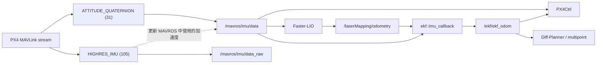

# Diff-Planner A8 mini：EKF 首次启动 50 Hz、二次启动约 170 Hz 根因分析报告

> 分析对象：`Bonjomondo/diff-planner-A8mini`<br>
> 仓库提交：`5998e7eee5c3d523f1e817a0c071cfc211ccb63b`<br>
> 分析日期：2026-08-14<br>
> 问题现象：首次冷启动后，`rostopic hz /ekf/ekf_odom` 经常只有约 50 Hz；关闭后再次启动，频率恢复到约 170 Hz。

> VS Code 阅读说明：报告中的项目代码均使用仓库相对链接。在 VS Code 中打开 Markdown 预览（macOS：`Cmd+Shift+V`，Windows/Linux：`Ctrl+Shift+V`）后，点击代码链接即可打开对应源码文件；链接文字中保留了建议查看的行号范围，可用 `Ctrl+G`/`⌃G` 输入起始行快速定位。外部 MAVROS、PX4 和 MAVLink 链接仍打开上游网页。

## 1. 执行摘要

### 1.1 根因结论

本问题的首要根因不是 EKF 算法偶发变慢，而是启动脚本对 PX4/MAVROS 消息频率的配置存在竞态：

1. `run_single_lio.sh` 启动 MAVROS 后只固定等待 2 秒；
2. 随即在后台发送 `MAV_CMD_SET_MESSAGE_INTERVAL(511)`，要求 MAVLink 消息 `ATTITUDE_QUATERNION(31)` 以 5,000 μs 周期发送，即目标 200 Hz；
3. 脚本没有等待 `/mavros/state.connected == true`，也没有检查每条命令的 `COMMAND_ACK`、退出码或实际话题频率；
4. 第一次冷启动时，USB 枚举、MAVROS 初始化和 FCU heartbeat 可能尚未完成，最早发送、同时也是最关键的消息 31 配置命令容易超时或未生效；
5. 配置未生效时，PX4 USB `CONFIG` 模式继续按默认约 50 Hz 发送 `ATTITUDE_QUATERNION`；
6. MAVROS 的 `/mavros/imu/data` 由 `ATTITUDE_QUATERNION` 回调驱动，而项目 EKF 又在每个 `/mavros/imu/data` 回调中发布一次 `/ekf/ekf_odom`，所以 50 Hz 会一比一传递到 EKF 输出；
7. 第二次启动时 PX4、USB 和 heartbeat 已处于热状态，同样的命令更容易成功，目标 200 Hz 经 PX4/MAVLink 调度后表现为实际约 170 Hz。

根因置信度：**高**。

尚缺的一条直接证据是“坏启动”现场消息 31 的失败 ACK。仓库中的 `flight_logs` 提交了启动脚本、参数和话题拓扑快照，但没有提交对应的 `console.log`、`rosbag.log`、ROS 日志正文或 rosbag 文件。因此当前结论是代码机制、精确频率指纹和历史启动异常共同支持的高置信度判断，而不是从失败 ACK 直接读出的结论。

### 1.2 50 Hz 和 170 Hz 分别代表什么

| 观测频率 | 实际含义 |
|---|---|
| 约 50 Hz | 消息 31 的 200 Hz 覆盖请求没有生效，PX4 保留 USB 模式默认频率 |
| 约 170 Hz | 200 Hz 请求已经生效，但受 PX4 MAVLink 主循环、数据源更新、总带宽和调度粒度影响，实际低于目标值 |

脚本中没有配置“170 Hz”。它实际请求的是 200 Hz。约 170 Hz 是当前硬件、PX4 和 MAVLink 链路的实际可达结果。

## 2. 分析范围和证据完整性

### 2.1 已检查内容

- 主启动脚本和初始化脚本；
- EKF launch、订阅、IMU 回调、状态传播和发布实现；
- Faster-LIO 的 IMU 输入配置；
- PX4Ctrl 的 IMU、里程计订阅和低频告警；
- 调试包装脚本的日志采集与进程清理方式；
- 仓库内 14 组 `run_single_lio.sh.snapshot`；
- 已提交的 `rosparams.yaml`、`rostopic_list.txt`、`rosnode_list.txt`；
- 仓库已有的 2026-08-11 飞行日志分析报告；
- MAVLink 命令定义、MAVROS 1.x IMU 插件和 PX4 MAVLink 默认流配置。

### 2.2 日志中可以直接确认的事实

1. 14 份启动脚本快照 SHA-1 完全一致，均为：

   ```text
   8cf7adcd245afc90d7e7f2e9774ea8fef6699491
   ```

   因而多次启动之间不存在“某次脚本参数不同”这一解释。

2. 可用参数快照均显示：

   ```yaml
   mavros:
     fcu_url: /dev/ttyACM0:57600
   ```

   即使用 PX4 USB CDC 设备 `/dev/ttyACM0`。

3. 正常拓扑快照中 `/mavros/imu/data`、`/mavros/imu/data_raw` 和 `/ekf/ekf_odom` 均只有一个 publisher；因此稳定 50 Hz 不是两个 publisher 互相覆盖造成的表面现象。

4. 已有报告证明重复启动时存在同名节点冲突和后台子进程残留。这会放大启动状态的不确定性，但不能单独解释“恰好稳定为 50 Hz”。

### 2.3 当前缺失的证据

仓库没有提交下列失败现场文件：

- `console.log`；
- `rosbag.log`；
- `key_events.log`；
- `flight_debug.bag`；
- ROS 节点日志正文；
- PX4 firmware version 和 `mavlink status streams` 输出。

因此不能从现有提交中直接读取：

- 首次启动时消息 31 的 `COMMAND_ACK`；
- 首次坏启动时 `/mavros/imu/data` 与 `/mavros/imu/data_raw` 的并行实测频率；
- PX4 当时的 stream configured/current rate；
- EKF 线程在坏启动时的 CPU 占用和回调队列延迟。

这些内容应在下一次复测中补录，见第 10 节。

## 3. 系统数据链路



必须注意：在 MAVROS 1.x 中，完整的 `/mavros/imu/data` 主要由消息 31 的姿态回调触发；消息 105 主要发布 `/mavros/imu/data_raw` 并更新线加速度数据。不能仅因为话题名是 IMU，就把 `/mavros/imu/data` 的频率归因于 `HIGHRES_IMU(105)`。

## 4. 根因证据链

### 4.1 启动脚本在连接就绪前按固定时间发送命令

核心代码：[`sh_files/run_single_lio.sh`](../sh_files/run_single_lio.sh)

```zsh
roslaunch mavros px4.launch & sleep 2;
rosrun mavros mavcmd long 511 31 5000 0 0 0 0 0 & sleep 1;
rosrun mavros mavcmd long 511 105 5000 0 0 0 0 0 & sleep 1;
```

这里存在四个独立缺陷：

1. `sleep 2` 只表达“过去了 2 秒”，不表达 FCU 已连接；
2. `mavcmd` 后面的 `&` 让命令在后台运行，脚本不会等待 ACK；
3. 后续 `sleep 1` 也不是 ACK 等待；多个命令客户端可能重叠；
4. 没有失败重试或启动中止条件。

对比 [`sh_files/run_init.sh`](../sh_files/run_init.sh)，该脚本等待了 6 秒才发送消息频率命令。这至少说明项目自身的两个启动入口对“MAVROS 需要多久才能工作”没有一致定义。即使 6 秒通常更可靠，它仍然只是时间猜测，不是连接状态检查。

### 4.2 消息 31 的命令含义是请求 200 Hz

命令：

```text
511 31 5000 0 0 0 0 0
```

解释：

- `511`：`MAV_CMD_SET_MESSAGE_INTERVAL`；
- 参数 1 `31`：需要配置的 MAVLink message ID；
- 参数 2 `5000`：相邻消息周期，单位 μs；
- `1,000,000 / 5,000 = 200 Hz`。

MAVLink 标准定义：<https://mavlink.io/en/messages/common.html#MAV_CMD_SET_MESSAGE_INTERVAL>

### 4.3 `/mavros/imu/data` 由消息 31 驱动

MAVROS 1.17 的 IMU 插件实现中：

- `handle_attitude_quaternion()` 调用 `publish_imu_data()`；
- `publish_imu_data()` 发布 `imu/data`；
- `handle_highres_imu()` 调用 `publish_imu_data_raw()`，发布 `imu/data_raw`。

上游实现：<https://github.com/mavlink/mavros/blob/1.17.0/mavros/src/plugins/imu.cpp#L299-L355>

这解释了为什么 `run_single_lio.sh` 第 5 行的消息 31 命令是最关键的命令，也给出了一个非常强的现场预测：

```text
如果 T+2 秒的消息 31 命令失败、T+3 秒的消息 105 命令成功：

/mavros/imu/data       ≈ 50 Hz
/mavros/imu/data_raw   ≈ 170 Hz
/ekf/ekf_odom          ≈ 50 Hz
```

如果下次坏启动复测得到这一组合，启动竞态即可视为直接确认。

### 4.4 EKF 输出没有独立限频，频率跟随 IMU 回调

EKF launch 将私有 `~imu` 映射到 `/mavros/imu/data`：

- [`ekf_lidar.launch:3-9`](../src/realflight_modules/ekf_pose/launch/ekf_lidar.launch)

EKF 主函数：

- [`ekf_node...cpp:1081-1085`](../src/realflight_modules/ekf_pose/src/ekf_node_vio_timesync_with_acc_pub.cpp)

```cpp
ros::Subscriber s1 = n.subscribe("imu", 1000, imu_callback, ...);
odom_pub = n.advertise<nav_msgs::Odometry>("ekf_odom", 1000); // freq = imu freq
```

IMU 回调在每次传播后调用：

```cpp
system_pub(X_state, new_msg->header.stamp);
```

对应 [`imu_callback:283-428`](../src/realflight_modules/ekf_pose/src/ekf_node_vio_timesync_with_acc_pub.cpp)。

该文件不存在 `ros::Rate(50)`、50 Hz timer 或“每 N 帧发布一次”的稳定限频逻辑。因此在初始化结束后：

```text
freq(/ekf/ekf_odom) ≈ freq(/mavros/imu/data)
```

### 4.5 50 Hz 与 PX4 USB 默认频率精确吻合

现场参数为 `/dev/ttyACM0`。以 PX4 v1.13.3 官方实现为例，PX4 将 `/dev/ttyACM*` 识别为 USB，并在没有显式模式时使用 `MAVLINK_MODE_CONFIG`。该模式的默认流包括：

```text
ATTITUDE_QUATERNION  50 Hz
HIGHRES_IMU          50 Hz
```

上游代码：<https://github.com/PX4/PX4-Autopilot/blob/v1.13.3/src/modules/mavlink/mavlink_main.cpp#L1589-L1617>

仓库没有记录现场 PX4 firmware version，所以不能直接断言现场恰好是 v1.13.3；但“USB + 消息 31 请求失败 + 稳定 50 Hz”与这个官方默认配置精确一致。复测时应记录实际 firmware version 和 `mavlink status streams`。

### 4.6 约 170 Hz 说明请求已生效但实际受限

PX4 文档指出 `MAV_X_RATE` 限制该 MAVLink 实例所有消息的总字节率；当总流量超限时，各消息实际频率会降低：

<https://docs.px4.io/v1.13/en/peripherals/mavlink_peripherals>

项目一次性将消息 31、105、83、147 和 106 都请求为 200 Hz，其中电池状态等消息没有必要以如此高的频率发送。即使某些消息受 uORB 更新频率限制，这种配置仍会增加总调度和带宽压力。

PX4 官方问题记录中也出现过目标 200 Hz、实际约 174 Hz 的现象：

<https://github.com/PX4/PX4-Autopilot/issues/3291>

因此，170 Hz 不是第二种配置状态，而是 200 Hz 请求成功后的当前实际输出。

## 5. 首次和二次启动的时间线重建

### 5.1 首次冷启动

| 相对时间 | 脚本动作 | 可能的系统状态 |
|---:|---|---|
| T+0 s | 后台启动 MAVROS | ROS master、插件、USB、FCU heartbeat 仍在初始化 |
| T+2 s | 后台请求消息 31 为 200 Hz | 最早、最关键，可能在 `connected=false` 时失败 |
| T+3 s | 后台请求消息 105 为 200 Hz | USB/heartbeat 可能刚刚就绪，可能成功 |
| T+4～6 s | 请求消息 83、147、106 | 链路逐渐稳定，但不检查 ACK |
| T+7 s | 启动 Faster-LIO | 使用 `/mavros/imu/data`，可能已经被锁定在 50 Hz |
| T+17 s | 启动 EKF | 每个 IMU 回调传播一次并尝试发布一次 |
| T+22 s | 启动 planner | EKF 可能仍在丢弃前 1000 条输出 |
| T+25 s | 启动 PX4Ctrl | 可能同时看到 IMU 和 ODOM 低频告警 |

### 5.2 第二次热启动

第二次启动时通常没有重新给飞控断电，因而：

- PX4 已完成启动；
- USB 设备已稳定；
- FCU heartbeat 到达更快；
- MAVROS command 服务很快具备有效目标系统；
- T+2 秒发送的消息 31 请求成功概率显著提高。

结果是 `/mavros/imu/data` 和 `/ekf/ekf_odom` 都恢复到约 170 Hz。

## 6. 次要问题及其影响

### 6.1 EKF 丢弃最初 1000 次 odom 发布

代码：[`system_pub:1292-1298`](../src/realflight_modules/ekf_pose/src/ekf_node_vio_timesync_with_acc_pub.cpp)

```cpp
static int cnt = 0;
if (cnt < 1000) {
    cnt++;
    return;
}
odom_pub.publish(odom_fusion);
```

其效果取决于 IMU 频率：

| IMU 频率 | 第一条 EKF odom 的额外等待时间 |
|---:|---:|
| 50 Hz | 约 20 秒 |
| 170 Hz | 约 5.9 秒 |
| 200 Hz | 约 5 秒 |

这使得 50 Hz 启动不仅更新慢，而且可能让 planner/PX4Ctrl 在启动后的十多秒内完全拿不到 `/ekf/ekf_odom`。

### 6.2 EKF 位置滤波器把采样率写死为 200 Hz

代码：[`system_pub:1239-1247`](../src/realflight_modules/ekf_pose/src/ekf_node_vio_timesync_with_acc_pub.cpp)

```cpp
double sample_freq = 200;
double freq = sample_freq / cutoff_freq;
```

`cutoff_freq` 配置为 20 Hz，但滤波器系数始终按 200 Hz 采样率计算。若实际输入为 50 Hz，相同归一化系数对应的实际截止频率约为 5 Hz；若实际为 170 Hz，则约为 17 Hz。

因此坏启动会改变滤波器动态特性，增加位置滞后，而不仅仅是少发消息。

### 6.3 Faster-LIO 同样依赖这一路 IMU

代码：[`faster-lio/config/mid360.yaml:1-6`](../src/realflight_modules/faster-lio/config/mid360.yaml)

```yaml
common:
  imu_topic: "/mavros/imu/data"
```

Livox 发布频率配置为 10 Hz。粗略计算：

- IMU 50 Hz：每个雷达周期约 5 个 IMU 样本；
- IMU 170 Hz：每个雷达周期约 17 个 IMU 样本。

低频会降低点云去畸变和状态传播的时间分辨率，并可能进一步影响 `/laserMapping/odometry` 的质量。

### 6.4 PX4Ctrl 同时依赖低频 IMU 和低频 EKF odom

代码：

- [`px4ctrl_node.cpp:35-54`](../src/realflight_modules/px4ctrl/src/px4ctrl_node.cpp)
- [`run_ctrl_lio.launch:3-7`](../src/realflight_modules/px4ctrl/launch/run_ctrl_lio.launch)

PX4Ctrl 直接订阅 `/mavros/imu/data`，同时将 odom 映射到 `/ekf/ekf_odom`。其输入代码明确在 IMU 或 ODOM 低于 100 Hz 时告警：

- [`input.cpp:147-159`](../src/realflight_modules/px4ctrl/src/input.cpp)
- [`input.cpp:187-199`](../src/realflight_modules/px4ctrl/src/input.cpp)

所以坏启动时控制器的两个主要状态输入会同时处于低频状态。

### 6.5 EKF 固定绑核是第二排查项，不是当前首因

代码：[`ekf_node...cpp:1065-1078`](../src/realflight_modules/ekf_pose/src/ekf_node_vio_timesync_with_acc_pub.cpp)

EKF 强制绑定 CPU core 5，并使用单线程 `ros::spin()`。如果 `/mavros/imu/data` 已经是 170 Hz、而 `/ekf/ekf_odom` 仍只有 50 Hz，才应重点检查：

- core 5 是否在线；
- core 5 是否同时承担其他重负载；
- `vioodom_callback()` 重传播是否长期阻塞 IMU 回调；
- IMU 队列是否积压，消息时间戳是否越来越旧。

但绑核或计算压力很难解释“第一次精确落在 PX4 默认 50 Hz、第二次恢复约 170 Hz”，因此不是当前首要根因。

### 6.6 调试脚本不能完整回收后台进程

代码：[`run_single_lio_debug.sh:26-49`](../sh_files/run_single_lio_debug.sh)

调试脚本只向 `RUN_PID` 对应的 shell 发送信号，没有对完整进程组进行终止和等待。仓库已有报告证明：包装脚本结束后，子孙 `roslaunch` 仍可继续运行，并在后续启动中产生同名节点冲突。

这会造成：

- 第二次启动不是完全干净的启动；
- 新旧 MAVROS、EKF 或 planner 发生注册替换；
- `Ctrl+C` 后操作者误以为系统已全部关闭；
- 频率配置和日志归属更难判断。

它属于启动可靠性的独立缺陷，应与消息频率竞态一起处理。

## 7. 排他分析

### 7.1 不是 LIO 的 10 Hz 直接把 EKF 限制为 50 Hz

EKF 需要第一帧 `/laserMapping/odometry` 完成初始化，但初始化后每个 IMU 回调都会传播和发布。LIO odom 回调负责校正，不是 EKF 高频输出的定时源。

### 7.2 不是 EKF launch 参数中配置了 50 Hz

`ekf_lidar.launch` 只有噪声、偏移、外参和滤波截止频率参数，没有发布频率参数。

### 7.3 不是 `sample_freq = 200` 控制发布频率

该变量仅用于计算位置低通滤波器系数，没有创建 timer 或 sleep，不能把输出调度成 50 Hz。

### 7.4 不是 ROS publisher queue size 造成固定 50 Hz

订阅和发布 queue size 均为 1000。队列积压可能导致延迟和丢包，但不会自然产生与 PX4 USB 默认值精确一致、且重启后稳定改变为约 170 Hz 的两态现象。

### 7.5 170 Hz 也不是 EKF 内部设定值

项目代码的显式目标是 200 Hz。约 170 Hz 是上游实际发送和接收能力的结果。

## 8. 主要应该看的代码

按排查优先级排序如下。

### P0：启动和 MAVLink 频率配置

1. [`sh_files/run_single_lio.sh:4-9`](../sh_files/run_single_lio.sh)

   重点看：

   - 为什么只等待 2 秒；
   - 为什么 `mavcmd` 放后台；
   - 是否等待 `/mavros/state.connected`；
   - 是否读取 `COMMAND_ACK`；
   - 命令失败是否重试；
   - 为什么 BATTERY_STATUS 等都请求 200 Hz。

2. [`sh_files/run_init.sh:3-6`](../sh_files/run_init.sh)

   重点看：它等待 6 秒，而主飞行脚本只等待 2 秒；两个入口行为不一致。

### P0：EKF 频率来源

3. [`ekf_pose/launch/ekf_lidar.launch:3-12`](../src/realflight_modules/ekf_pose/launch/ekf_lidar.launch)

   重点看：EKF 输入明确是 `/mavros/imu/data`，而不是 `data_raw`。

4. [`ekf_node_vio_timesync_with_acc_pub.cpp:283-428`](../src/realflight_modules/ekf_pose/src/ekf_node_vio_timesync_with_acc_pub.cpp)

   重点看：一条 IMU 消息完成一次传播并调用一次 `system_pub()`。

5. [`ekf_node_vio_timesync_with_acc_pub.cpp:1081-1085`](../src/realflight_modules/ekf_pose/src/ekf_node_vio_timesync_with_acc_pub.cpp)

   重点看：源码注释已经写明 `ekf_odom` 的频率等于 IMU 频率。

### P1：低频时被放大的内部问题

6. [`ekf_node_vio_timesync_with_acc_pub.cpp:1239-1247`](../src/realflight_modules/ekf_pose/src/ekf_node_vio_timesync_with_acc_pub.cpp)

   重点看：滤波器采样率硬编码为 200 Hz。

7. [`ekf_node_vio_timesync_with_acc_pub.cpp:1292-1298`](../src/realflight_modules/ekf_pose/src/ekf_node_vio_timesync_with_acc_pub.cpp)

   重点看：无条件丢弃最初 1000 次 odom 发布。

8. [`ekf_node_vio_timesync_with_acc_pub.cpp:1065-1135`](../src/realflight_modules/ekf_pose/src/ekf_node_vio_timesync_with_acc_pub.cpp)

   重点看：固定 core 5、单线程 `ros::spin()` 和回调队列设计。

### P1：受影响的下游模块

9. [`faster-lio/config/mid360.yaml:1-6`](../src/realflight_modules/faster-lio/config/mid360.yaml)

   重点看：Faster-LIO 与 EKF 共用 `/mavros/imu/data`。

10. [`px4ctrl/src/px4ctrl_node.cpp:35-54`](../src/realflight_modules/px4ctrl/src/px4ctrl_node.cpp)

    重点看：PX4Ctrl 同时消费 EKF odom 和 MAVROS IMU。

11. [`px4ctrl/src/input.cpp:147-199`](../src/realflight_modules/px4ctrl/src/input.cpp)

    重点看：低于 100 Hz 的告警逻辑，可作为现场旁证。

### P1：重启后残留进程

12. [`sh_files/run_single_lio_debug.sh:26-49`](../sh_files/run_single_lio_debug.sh)

    重点看：只杀 shell PID，没有完整管理后台 `roslaunch` 进程组。

## 9. 根因树和优先级

```text
/ekf/ekf_odom 首次只有 50 Hz
|
+-- P0 直接原因：/mavros/imu/data 只有 50 Hz
|   |
|   +-- P0 消息 31 的 200 Hz 命令发在 connected 之前
|   +-- P0 mavcmd 后台执行，不等待/检查 COMMAND_ACK
|   +-- P0 失败后没有重试和 fail-fast
|   +-- PX4 保留 USB CONFIG 默认 50 Hz
|
+-- P1 放大因素
|   |
|   +-- EKF 丢弃前 1000 次输出：50 Hz 时延迟约 20 秒
|   +-- 位置滤波器采样率固定 200 Hz：50 Hz 时动态特性错误
|   +-- Faster-LIO、EKF、PX4Ctrl 共用同一路低频 IMU
|   +-- 多个不必要消息都请求 200 Hz，增加链路调度压力
|
+-- P1 启动可靠性问题
    |
    +-- Ctrl+C/调试脚本不能完整清理后台进程
    +-- 第二次启动可能伴随同名节点替换或残留进程
```

## 10. 一次性确认根因的复测方案

### 10.1 坏启动出现后先不要重启

分别在终端运行：

```bash
rostopic hz /mavros/imu/data
rostopic hz /mavros/imu/data_raw
rostopic hz /ekf/ekf_odom
rostopic echo -n 1 /mavros/state
```

记录至少 20 秒稳定统计，特别记录 `/mavros/state.connected`。

### 10.2 在 `connected: True` 后前台重发消息 31

```bash
rosrun mavros mavcmd long 511 31 5000 0 0 0 0 0
```

不要放到后台。保存完整输出和 ACK。随后再次测：

```bash
rostopic hz /mavros/imu/data
rostopic hz /ekf/ekf_odom
```

### 10.3 结果判读

| 结果 | 判定 |
|---|---|
| `imu/data≈50` 且 `ekf≈50` | 上游消息 31 低频，与主根因一致 |
| `data_raw≈170`、`imu/data≈50` | 消息 105 成功、最早的消息 31 抢跑失败；最强证据 |
| 手动重发 31 后，无需重启 EKF，两者立即从 50 升到约 170 | 根因直接确认 |
| `imu/data≈170`、`ekf≈50` | 主根因不适用于该次现场，转查 EKF 单线程、core 5 和回调积压 |
| `imu/data` 与 `ekf` 都明显抖动、持续下降 | 检查 CPU/队列/网络调度，不属于稳定默认 50 Hz 模式 |

### 10.4 建议同步记录

```bash
rostopic echo /mavros/state
rostopic hz /mavros/imu/data
rostopic hz /mavros/imu/data_raw
rostopic hz /laserMapping/odometry
rostopic hz /ekf/ekf_odom
rostopic delay /mavros/imu/data
rostopic delay /ekf/ekf_odom
```

如果能进入 PX4 MAVLink shell，同时保存：

```text
ver all
mavlink status
mavlink status streams
```

## 11. 修复设计建议

本报告不直接修改飞行代码，但建议修复遵循以下顺序。

### 11.1 用状态门槛替换固定 sleep

正确的启动前置条件至少包括：

1. ROS master 可用；
2. `/mavros/cmd/command` 服务存在；
3. `/mavros/state.connected == true` 连续稳定；
4. 每条 `MAV_CMD_SET_MESSAGE_INTERVAL` 前台执行；
5. 收到 `MAV_RESULT_ACCEPTED`；
6. 失败时有限重试，最终失败则中止后续飞行栈启动。

### 11.2 加入实际频率门槛

只有在下列条件满足后才启动 Faster-LIO、EKF、planner 和 PX4Ctrl：

```text
/mavros/imu/data       > 安全阈值
/mavros/imu/data_raw   > 安全阈值
```

阈值应根据实际控制和 LIO 要求确定，不应简单把“能收到消息”视为成功。

### 11.3 精简 MAVLink 高频请求

当前把消息 31、105、83、147、106 全部请求为 200 Hz。应逐条明确消费者和最低必要频率：

- `ATTITUDE_QUATERNION(31)`：直接决定 `/mavros/imu/data` 输出频率，优先级最高；
- `HIGHRES_IMU(105)`：决定 raw IMU/加速度更新，优先级高；
- `ATTITUDE_TARGET(83)`：根据监控和控制需求决定，通常无需与 IMU 同频；
- `BATTERY_STATUS(147)`：不应请求为 200 Hz；
- `OPTICAL_FLOW_RAD(106)`：只有确实使用光流时才配置所需频率。

精简流量后再评估为什么实际只有约 170 Hz，以及是否真的需要追求 200 Hz。

### 11.4 修正 EKF 内部对频率的隐含假设

- 用实际时间戳或实测采样周期计算滤波器系数；
- 不要将 `sample_freq` 固定为 200；
- 将“丢弃前 1000 帧”替换为明确的状态收敛条件或时间条件；
- 在日志中输出输入 IMU 频率、回调处理频率、队列延迟和输出频率；
- 必要时重新评估固定绑 core 5 和单线程 `ros::spin()`。

### 11.5 完整管理进程生命周期

- 优先使用单一顶层 roslaunch 管理整套节点；
- 或让脚本创建独立进程组，退出时向整个进程组发信号并等待所有子进程；
- 启动前检查 `/mavros`、`/ekf`、`/laserMapping`、`/px4ctrl` 是否已存在；
- 如果存在，明确拒绝重复启动，而不是让 ROS 同名节点互相踢下线。

## 12. 修复后的验收标准

### 12.1 连续冷启动

至少进行 10 次“PX4 和机载电脑均重新上电”的冷启动测试：

- 10 次均在启动脚本继续执行前确认 `connected=true`；
- 10 次消息 31、105 均收到 accepted ACK；
- 10 次 `/mavros/imu/data` 均达到定义的最低频率；
- 10 次 `/ekf/ekf_odom` 均跟随 `/mavros/imu/data`；
- 不允许靠第二次重启恢复。

### 12.2 频率和延迟

同时记录：

- 平均频率、最小/最大间隔、标准差；
- 消息 header stamp 到接收时间的延迟；
- EKF 回调积压情况；
- PX4Ctrl 是否再出现 IMU/ODOM `<100 Hz` 告警。

### 12.3 失败必须 fail-fast

如果消息频率配置或实测频率不达标：

- 不启动 planner；
- 不启动 PX4Ctrl 自动飞行流程；
- 输出明确错误：失败的 message ID、ACK、当前频率和重试次数；
- 保留 MAVROS 和传感器用于诊断，但禁止进入可起飞状态。

## 13. 最终结论

整个问题可以归纳为一条链：

```text
固定 sleep 2 秒
→ 消息 31 配置命令在 FCU 未连接时抢跑
→ PX4 保留 USB 默认 50 Hz
→ MAVROS /imu/data 只有 50 Hz
→ EKF 每个 IMU 回调发布一次
→ /ekf/ekf_odom 稳定为 50 Hz
→ 第二次热启动时命令成功
→ 200 Hz 请求实际表现为约 170 Hz
```

因此，第一修复对象应是 `run_single_lio.sh` 的 MAVROS 就绪判断、命令 ACK 和频率验收，而不是先优化 EKF 矩阵运算。EKF 中的前 1000 帧抑制、固定 200 Hz 滤波器和固定绑核属于需要随后处理的放大因素和可靠性问题。
