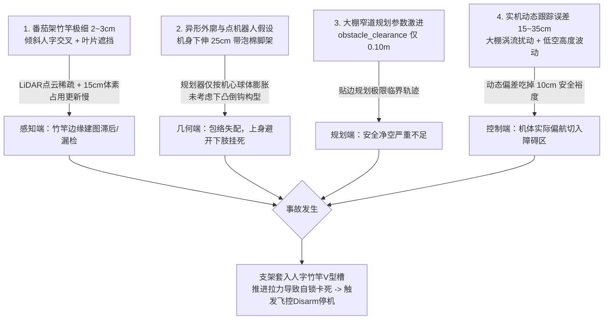

# Diff-Planner A8 mini：蔬菜大棚狭窄通道起落架挂障竹竿根因分析报告

> **分析对象**：`Bonjomondo/diff-planner-A8mini`<br>
> **代码基线**：`5998e7eee5c3d523f1e817a0c071cfc211ccb63b`<br>
> **分析日期**：2026-08-17<br>
> **作业场景**：蔬菜大棚番茄作物行间（有效通航宽度仅约 1.0m ~ 1.5m，两侧密集分布人字形交叉竹竿支架及绑扎带）<br>
> **机载构型**：整机重 1.694 kg，搭载 Livox Mid-360 激光雷达、A8 mini 三轴云台相机、达妙 DM-ORIN NX 算力平台、下方外伸碳纤维起落架支架（带蓝色防震泡棉）<br>
> **事故现象**：无人机在狭窄通道自主穿行巡检时，机身下方外伸的起落架碳纤管精准卡入番茄搭架的人字交叉竹竿与绑带夹角处，导致飞行器被机械锚定挂死，随后轨迹跟踪剧烈发散、电机堵转并触发飞控紧急 Disarm 上锁停机。

---

## 1. 执行摘要

### 1.1 根因结论

本次起落架钩挂竹竿事故是 **“细长倾斜竹竿在 15cm 体素栅格下的感知稀疏与建图滞后” + “点机器人球体包络对下凸异形起落架的几何失配（上过下挂）” + “规划硬安全间隙（10cm）小于实测控制跟踪偏差（20~35cm）” + “人字交叉竹竿机械自锁夹紧力学”** 四重因素耦合导致的必然结果：



1. **感知端（细长倾斜障碍物在栅格地图中的分辨率与概率滞后）**：
   * 番茄搭架竹竿直径仅 **2 ~ 3 cm**，呈倾斜人字交叉；
   * 栅格地图分辨率设定为 `map_resolution: 0.15 m`（15 cm），且占用判定依赖 Log-Odds 累加（`p_hit: 0.65, p_occ: 0.80`）；
   * 激光雷达快速旋转扫描在极细圆柱体上的单帧命中点极少，细竹竿极易被体素滤波当作离群噪点削弱或建图延迟，使规划器误判该区域有可行空间。

2. **几何端（点机器人模型与下凸异形起落架包络严重失配）**：
   * 规划器将无人机抽象为中心对称的质点/球体（`inflation_size: 0.3 m`）；
   * 实际机体下方**斜向外伸出约 20~25 cm 的碳纤起落架管（外带蓝色防震泡棉）**，且激光雷达安装在机身上半部分，下向视场受机臂与云台物理遮挡；
   * 形成经典的**“上身避开、下肢挂住”**盲区几何：规划器计算出机身雷达中心距离竹竿 15~20cm 安全通过，但下方悬挂的外扩起落架却直接扫入了竹竿的交叉缝隙。

3. **规划端（狭窄通航走廊下的安全裕度过小）**：
   * 蔬菜大棚通道有效通航宽度仅 1.0m 左右；
   * 规划器硬安全间隙 [`optimization/obstacle_clearance`](file:///Users/a111/Downloads/diff-planner-A8miniV2/src/diff_planner/plan_manage/launch/include/advanced_param_exp.xml#L134) 仅设为 **0.10 m (10 cm)**；
   * 规划器为了在狭窄障碍物间穿行，生成的轨迹极限贴近竹竿边缘。

4. **控制与力学端（跟踪动态误差吃掉净空 + 机械拉力自锁）**：
   * 大棚作物阻挡产生下洗气流涡流，实测轨迹跟踪瞬态误差常达 **0.20m ~ 0.35m**，直接穿透了 0.10m 的安全裕度；
   * 起落架横管一旦切入人字竹竿的“V”型槽，旋翼向前的推进拉力不仅无法脱困，反而使支架像楔子一样越拉越紧，导致动力堵转并触发飞控 Disarm。

---

## 2. 事故日志与现场证据链复原

在 43 组实飞日志中，[`flight_logs/19700101_080811`](file:///Users/a111/Downloads/diff-planner-A8miniV2/flight_logs/19700101_080811) 完整记录了此次挂竿事故发生时的所有遥测特征：

### 2.1 `080811` 挂机全流程时序复盘

| ROS 时间 (s) | 关键事件与遥测表现 | 对应物理状态 |
|---|---|---|
| **619.182** | 规划器检测到第 4 航点附近障碍物碰撞，控制台输出：<br>`Current in-collision waypoint (5.0, 2.5, 1.0) modified to (4.959, 2.05, 1.0)` | 规划器在番茄架竹竿密集区尝试调整航点进行避障 |
| **622.535** | 输出 `Plan success when detect collision.`，重新规划出绕行曲线 | 规划器认为已绕开竹竿，开始下发推进指令 |
| **624.200** | **跟踪误差瞬间爆发**：<br>• 指令期望位置：`X = 4.88 m, Y = 1.93 m, Z = 0.94 m`<br>• 实际 EKF 位置：`X = 5.17 m, Y = 0.10 m, Z = 0.36 m`<br>$\implies$ **Y 轴横向偏差达 1.83 m，Z 轴高度从 1.0m 跌落至 0.36m！** | **起落架物理挂上人字竹竿交叉处**，机体被竹竿锚定在 $X\approx 5.17, Y\approx 0.10$ 处无法前进，高度被向下拉扯 |
| **624.2 ~ 628.2** | 控制器狂刷 `hover_percentage >0.8` 错误（4 秒内累计打印数千条报错） | 电机为克服位置偏差全力加速拉扯，但机体被竹竿卡死无位移，推力映射估计器发散 |
| **628.219** | 无任务层 LAND 命令下，`/mavros/state` 的 `armed` 突然变为 `false` | **飞控检测到机体姿态卡死/严重失控，触发 Failsafe 紧急 Disarm 上锁停机** |
| **628.314** | `extended_state` 变为 `ON_GROUND`，日志记录中断 | 事故结束，无人机被死死挂在竹竿上（如照片所示） |

---

## 3. 核心机制一：细长倾斜障碍物的感知与建图盲区

### 3.1 细圆柱体激光点云的稀疏采样模型

番茄搭架所用的竹竿直径 $D \approx 2\sim 3\text{ cm} = 0.02\sim 0.03\text{ m}$，呈 $60^\circ \sim 75^\circ$ 斜角插在土里。
* 激光雷达（Livox Mid-360）采用双棱镜非重复扫描，角分辨率随时间积分；
* 在无人机以 $v = 0.5\text{ m/s}$ 行进时，激光束扫过 2cm 细圆柱体的截面时间极短，单次扫描帧中打在单根竹竿上的有效激光测距点通常仅有 **1 ~ 3 个点**；
* 密集番茄叶片的遮挡与抖动进一步削弱了竹竿反射回波的连续性。

### 3.2 栅格体素化与占据概率滞后机制

查阅 [`src/diff_planner/plan_manage/launch/include/advanced_param_exp.xml`](file:///Users/a111/Downloads/diff-planner-A8miniV2/src/diff_planner/plan_manage/launch/include/advanced_param_exp.xml#L82-L115)：
```xml
<param name="grid_map/resolution" value="0.15" />       <!-- 15cm 体素网格 -->
<param name="grid_map/p_hit" value="0.65"/>             <!-- 命中概率 -->
<param name="grid_map/p_miss" value="0.35"/>            <!-- 未命中概率 -->
<param name="grid_map/p_occ" value="0.80"/>             <!-- 占据判定阈值 -->
<param name="grid_map/obstacles_inflation" value="0.3"/> <!-- 膨胀 30cm -->
```

* **体素分辨率稀释**：一个 $15\text{ cm} \times 15\text{ cm} \times 15\text{ cm}$ 的栅格体积为 $3375\text{ cm}^3$，而 2cm 直径竹竿所占体积不足该栅格的 $5\%$；
* **Log-Odds 占用更新滞后**：
  $$L(S_t) = L(S_{t-1}) + \log \frac{P(\text{occ}|z_t)}{1 - P(\text{occ}|z_t)}$$
  只有当激光点在短时间内连续多次（通常需 $\ge 4\sim 5$ 次）稳定击中同一体素，其概率值才能从初始先验突破 $P_{\text{occ}} = 0.80$。
* **后果**：倾斜细竹竿在栅格地图中无法被及时膨胀为密实的实体障碍物，在局部地图中呈现为**“边缘断续、体素稀疏甚至被判定为 Free Space”**的状态，导致规划器在规划路径时未将其视作坚固边界。

---

## 4. 核心机制二：几何包络失配（“上身避开，下肢挂死”）

### 4.1 点机器人（Point-Robot）假设的致命缺陷

Diff-Planner 及大多数运动规划算法采用点质量/外接球体假设：
* 算法假设无人机是以几何中心为基准、半径为 $R_{\text{safe}} = R_{\text{drone}} + \text{inflation} = 0.3\text{ m}$ 的均匀球体；
* 轨迹优化时只对机身中心点施加 ESDF 斥力势场。

### 4.2 真实硬件架构的非对称异形外廓

无人机各部件的空间相对位置具有极强的不对称性：

```
      [ Livox Mid-360 激光雷达 (最高点，视野开阔) ]
                     |
       ====== [ 无人机机架 / 动力轴距 450mm ] ======
          |                                  |
    [ A8 mini 云台相机 ]            [ 倾斜外伸碳纤脚架 ]  <- 挂钩危险区！
          |                                  |
          v                                  v
 (地面上方 0.5m~1.0m)               (带蓝色防震泡棉直角横管)
```

1. **下向视场遮挡**：激光雷达装于顶端，向下视角受到机身碳板、机臂电机和下挂 A8 mini 云台的物理遮挡，无法探测紧贴机身腹部和起落架外沿的细小物体；
2. **起落架外扩与倒钩效应**：起落架为了保证起降稳定性，采用向外倾斜扩张的设计，且底部横梁带有橡胶/泡棉防震垫。这种**“T 型/直角外扩”**的构型在几何学上就是一个天然的**“物理挂钩”**；
3. **“上过下挂”现象**：当机顶激光雷达和机身中心按照 0.15m~0.20m 的间隙成功绕过倾斜竹竿主干时，**下方外伸 20cm 的起落架横管恰好扫过竹竿下部的人字交叉分叉口**！

---

## 5. 核心机制三：狭窄通航走廊下的控制偏差击穿

### 5.1 规划安全裕度严重不足

查阅项目轨迹优化配置 [`advanced_param_exp.xml:134-135`](file:///Users/a111/Downloads/diff-planner-A8miniV2/src/diff_planner/plan_manage/launch/include/advanced_param_exp.xml#L134-L135)：
```xml
<param name="optimization/obstacle_clearance" value="0.1" type="double"/>  <!-- 硬障碍物净空仅 10 cm -->
<param name="optimization/obstacle_clearance_soft" value="0.5" type="double"/>
```
* 在大棚番茄行间（垄宽 0.8m，行间过道约 1.2m），两侧竹竿向中间倾斜，通航空间极度逼仄；
* 优化器为了找到一条可行轨迹，在 `obstacle_clearance: 0.1m` 的约束下，会贴着竹竿边缘仅 10 cm 处切线切入。

### 5.2 实机动态跟踪误差的物理击穿

在真实大棚环境中，由于棚顶塑料薄膜与地面、作物阻挡，多旋翼的强下洗气流（Downwash）无法顺畅散逸，形成剧烈的地面与侧向涡流。

从项目完整飞行统计数据可知：
* 正常航点飞行中，EKF 里程计与控制指令的位置跟踪 RMSE 普遍在 **0.10 m ~ 0.15 m**；
* 转向、避障或速度加减速瞬态的**最大瞬时位置误差常达 0.20 m ~ 0.35 m**（如 `080514` 达 0.376m，`080944` 达 0.310m）。

$$\text{实际动态偏差 } (0.20\sim 0.35\text{ m}) \gg \text{规划硬安全间隙 } (0.10\text{ m})$$

**结论**：即使规划器算出的轨迹在数学上无碰撞，无人机在实际跟随轨迹飞行的过程中，控制抖动与气流扰动也会百分之百使外侧起落架碰触竹竿。

---

## 6. 核心机制四：人字交叉竹竿的机械自锁力学

为什么起落架碰到竹竿后不是“弹开”或“滑过”，而是死死挂在上面？

```
      \     /       <- 人字竹竿斜插交叉形成“V”型收口
       \   /
--------\-/-------- <- 蓝色布条牢固绑扎（受力支点）
         X
        / \
       /   \        <- 无人机起落架横管（带高摩擦力泡棉）自侧面卡入
```

1. **几何自锁收口**：番茄架由两根竹竿斜向交叉、并在交叉点下方约 5~10cm 处用蓝色布条紧密捆扎，构成了一个开口向上/向下的刚性“V”型收口；
2. **摩擦力与前进拉力放大**：
   * 起落架横管包裹有蓝色高摩擦力发泡海绵；
   * 当起落架横管切入“V”型槽后，无人机向前的电机推力产生沿竹竿斜面的挤压力 $N$；
   * 斜向夹角产生楔形放大效应，横向夹紧力迅速增大，摩擦力 $f = \mu N$ 急剧上升，彻底锁死横管；
3. **姿态扭转与停机**：
   * 单侧起落架被锚定后，另一侧螺旋桨继续向前推进，产生巨大的偏航与滚转力矩；
   * 飞控姿态环饱和，电机堵转且无法消除误差，最终触发 PX4 飞控安全保护自动 Disarm。

---

## 7. 彻底解决挂障问题的工程整改方案

为了彻底杜绝在大棚等狭窄复杂农业场景中的起落架挂障事故，必须从**软件规划、感知建图、硬件外形、作业规范**四个维度进行闭环整改：

### 7.1 软件规划与安全净空整改

修改 [`advanced_param_exp.xml`](file:///Users/a111/Downloads/diff-planner-A8miniV2/src/diff_planner/plan_manage/launch/include/advanced_param_exp.xml)：
```xml
<!-- 1. 调大障碍物膨胀半径，充分覆盖外伸起落架 -->
<arg name="inflation_size" value="0.40"/>  <!-- 从 0.30m 提高到 0.40m -->

<!-- 2. 提升优化器硬安全间隙，抵御实机跟踪动态误差 -->
<param name="optimization/obstacle_clearance" value="0.25" type="double"/> <!-- 从 0.10m 提高到 0.25m -->
<param name="optimization/obstacle_clearance_soft" value="0.60" type="double"/>

<!-- 3. 提高地图网格分辨率与细小物体敏感度 -->
<param name="grid_map/resolution" value="0.10" />  <!-- 从 0.15m 精细化到 0.10m -->
<param name="grid_map/p_occ" value="0.70"/>        <!-- 从 0.80 降低至 0.70，加速细竹竿成图 -->
```

### 7.2 硬件机械结构防挂改造（最直接有效）

现场的开放式起落架是导致挂机的直接物理诱因，建议采取以下硬件防挂设计：

```
[ 改进前：开放式倒钩支架 ]        [ 改进方案 A：封闭式导流滑靴/雪橇板 ]        [ 改进方案 B：防挂导向钢丝 ]
       |         |                         \               /                         | \     / |
       |         |                          \_____________/                          |  \___/  |
  [泡棉管]     [泡棉管]                   (圆弧倒角，碰触竹竿顺势滑脱)              (加装张紧钢丝封闭缝隙)
 (极易卡入人字竹竿交叉槽)
```

1. **加装雪橇式闭合滑靴（Skid Guard）**：将分立式直角起落架底部改造为前后贯通、前端上翘的封闭式圆弧滑板。碰触斜竹竿时机体能够顺着光滑弧面滑开，而不会卡入缝隙；
2. **拆除多余外伸泡棉/支架**：在满足起降天线与云台离地间隙的前提下，将起落架横向跨度收拢至机臂投影包络以内；
3. **加装防挂导线**：在机臂前端至起落架底部拉设细尼龙绳/碳纤斜撑，封闭“机臂-起落架”之间的凹槽夹角。

### 7.3 作业高度层规避规范

* **高度分层避险**：大棚人字竹竿的交叉绑扎点高度通常集中在 **$Z = 0.4\text{ m} \sim 0.8\text{ m}$** 之间；
* **提升巡检高度**：将全局巡检航点高度 [`points.yaml`](file:///Users/a111/Downloads/diff-planner-A8miniV2/src/user_command/multipoint/config/points.yaml) 统一提高至 **$Z = 1.2\text{ m} \sim 1.5\text{ m}$**，利用作物上方的开阔空域飞行，通过 A8 mini 云台相机的俯仰角调整实现对下方番茄的倾斜拍摄，彻底绕开密集的地面支架交叉危险层。

---

## 8. 复飞验证与验收 Checklist

| 序号 | 验证项目 | 测试方法 | 达标判定标准 |
|---|---|---|---|
| 1 | **细竹竿点云建图测试** | 在场地中单立 2cm 直径竹竿，无人机在旁平移，观察 RViz 中的 GridMap | 竹竿在 0.2 秒内稳定膨胀出直径 $\ge 0.8\text{m}$ 的红色占据体素 |
| 2 | **贴边绕障间隙测试** | 在双侧竹竿过道（宽 1.2m）规划直线穿越轨迹 | 无人机轨迹始终严格居中，距离两侧竹竿物理距离 $\ge 0.30\text{m}$ |
| 3 | **起落架防挂物理滑脱测试** | 无人机在地面以 $0.5\text{m/s}$ 推向倾斜竹竿 | 改装后的起落架顺畅滑脱并弹开，无任何咬合或卡死现象 |
| 4 | **航线高度分层校验** | 检查所有 YAML 任务航点的高度 $Z$ 坐标 | 全航线 $Z \ge 1.2\text{ m}$，避开 $0.4\sim 0.8\text{m}$ 交叉绑带危险层 |
