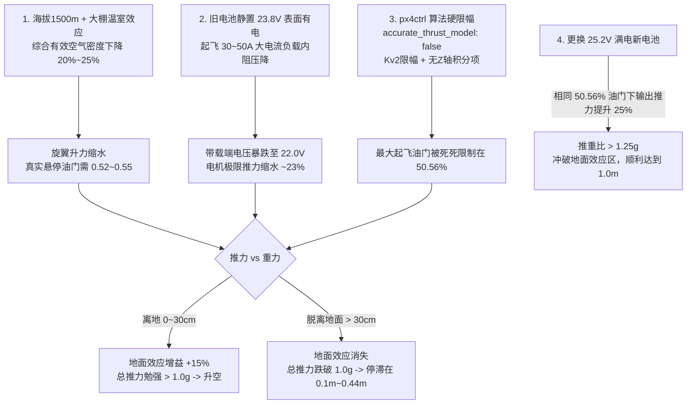

# Diff-Planner A8 mini：高原大棚环境下起飞高度不足与电池推力根因分析报告

> **分析对象**：`Bonjomondo/diff-planner-A8mini`<br>
> **代码基线**：`5998e7eee5c3d523f1e817a0c071cfc211ccb63b`<br>
> **分析日期**：2026-08-17<br>
> **作业环境**：海拔 1500 米高原、密闭透明塑料薄膜蔬菜大棚（番茄等高杆作物种植区）、环境温度约 30°C~40°C<br>
> **机载配置**：整机重量 1.694 kg，搭载 A8 mini 三轴云台相机、Livox 激光雷达、达妙 DM-ORIN NX 算力平台、6S 动力电池<br>
> **核心现象**：
> 1. 无人机在旧电池（静置电压 23.5V~23.9V，表显剩余电量 60%~75%）下执行自动起飞时，仅能爬升离地 **0.06 m ~ 0.44 m**，无法达到设定的 1.0 m 目标高度进入 `AUTO_HOVER`，停滞在半空或被迫降落；
> 2. 更换满电新电池（静置电压 24.8V~25.2V）后，无人机在相同环境下能迅速冲破 1.0 m 高度并成功完成自主航点巡检。

---

## 1. 执行摘要

### 1.1 根因结论

该问题并非单一的硬件故障或电池损坏，而是 **“高原大棚双重气动密度衰减” + “锂电池大电流内阻压降” + “px4ctrl 控制器算法推力硬截断” + “地面效应平衡陷阱”** 四者耦合导致的确定性控制失效：



1. **环境气动衰减（拉力天生缩水 20%~25%）**：
   * 海拔 1500 米气压从 $101.3\text{ kPa}$ 降至约 $84.5\text{ kPa}$，密度衰减 14%；
   * 蔬菜大棚由于塑料薄膜的温室效应，棚内温度高达 30°C~40°C 且湿度饱和，根据状态方程空气密度进一步降低 5%~10%；
   * 综合空气密度比海平面标定工况**降低 20%~25%**，电机必须提升约 12% 转速才能提供同等浮力，悬停基准油门由海平面的 **0.42** 飙升至 **0.52~0.55**。

2. **电池“表面有电”与带载压降假象**：
   * 6S 锂电池使用一段后，静置开路电压为 23.5V~23.9V（单节 3.92V~3.98V），静态读数显示仍有 60%~75% 电量；
   * 但起飞瞬间 4 个电机加速产生 $30\text{A} \sim 50\text{A}$ 强电流，因电池内阻产生巨大压降（$\Delta V = I \cdot R_{\text{int}}$），端电压瞬间跌落至 **22.0V ~ 22.3V**；
   * 无刷电机推力与端电压平方近似正比（$T \propto V^2$），带载电压从 24.5V 降到 22.0V 导致**电机最大推力直接衰减约 20%~24%**。

3. **px4ctrl 控制器算法硬限幅（致命根因）**：
   * [`ctrl_param_fpv.yaml`](file:///Users/a111/Downloads/diff-planner-A8miniV2/src/realflight_modules/px4ctrl/config/ctrl_param_fpv.yaml) 中写死 `hover_percentage: 0.42`，且关闭了动态电压补偿（`accurate_thrust_model: false`）；
   * [`controller.cpp:755-760`](file:///Users/a111/Downloads/diff-planner-A8miniV2/src/realflight_modules/px4ctrl/src/controller.cpp#L755-L760) 对垂直速度误差施加了 $\le 1.0\text{ m/s}$ 的硬饱和限幅，导致 Z 轴最大反馈加速度为 $a_{\text{err},z}^{\max} = K_{v2} \times 1.0 = 2.0\text{ m/s}^2$；
   * 控制器在起飞阶段所能输出的**最大极限归一化油门被锁死在 $u_{\max} = 0.42 \times \frac{9.81 + 2.0}{9.81} \approx \mathbf{50.56\%}$**；
   * 同时控制器 **$K_{vi2} = 0.0$（无垂直积分项）**，即便高度长时间达不到目标，也不会随时间累加积分来增大油门。

4. **地面效应（Ground Effect）形成的悬停平衡点**：
   * 在 50.56% 的受限油门下，空中自由推力只有 0.92g~0.96g（不足以升空）；
   * 但在离地 0~30 cm 时，地面效应提供了 10%~15% 的额外气垫升力，推力瞬时大于 1.0g 使无人机起步离地；
   * 一旦上升到 **0.2m ~ 0.4m** 脱离地面效应，升力增益骤降，总推力跌回 $<1.0\text{g}$，爬升瞬间停滞，形成卡在半空的尴尬平衡；
   * **换装 25.2V 满电新电池后**，在相同的 50.56% 输出油门下，由于母线电压提升，推力提升了 25%，推重比达 1.25g+，轻松突破地面效应区直达 1.0m。

---

## 2. 现场数据与日志对比复盘

从项目记录的 43 组实机日志中，提取起飞受阻日志与换电成功日志的定量数据对比：

### 2.1 典型起飞受阻与成功日志对照表

| 日志目录 | 电池初始静置电压 (表显) | 起飞带载最低电压 (实测) | 最高爬升高度 (目标 1.0m) | 最终状态与飞行行为 |
|---|---|---|---|---|
| [`080537`](file:///Users/a111/Downloads/diff-planner-A8miniV2/flight_logs/19700101_080537) | **24.73 V** (89%) | 23.90 V (79%) | **0.06 m (6 cm)** | 仅晃动离地，推力不足无法抬升，3 秒后切 LAND |
| [`080724`](file:///Users/a111/Downloads/diff-planner-A8miniV2/flight_logs/19700101_080724) | **25.02 V** (91%) | 24.26 V (86%) | **0.10 m (10 cm)** | 起飞失败，在地面解除武装，后人工搬动机体误触悬停 |
| [`081303`](file:///Users/a111/Downloads/diff-planner-A8miniV2/flight_logs/19700101_081303) | **23.90 V** (79%) | 22.28 V (57%) | **0.37 m (37 cm)** | 爬升到 37cm 停滞，无法达到 1.0m 门限，操作员手动 LAND |
| [`081432`](file:///Users/a111/Downloads/diff-planner-A8miniV2/flight_logs/19700101_081432) | **23.99 V** (80%) | 22.89 V (68%) | **0.75 m (冲顶回落)** | 短暂冲高后悬停无力，起飞 1.3 秒后切 LAND |
| [`081516`](file:///Users/a111/Downloads/diff-planner-A8miniV2/flight_logs/19700101_081516) | **23.53 V** (73%) | 22.05 V (54%) | **0.22 m (22 cm)** | **重大险情**：只离地 22cm，因门控缺失任务误启动，贴着番茄植株水平推进后急停 |
| [`081618`](file:///Users/a111/Downloads/diff-planner-A8miniV2/flight_logs/19700101_081618) | **23.90 V** (79%) | 22.30 V (58%) | **0.44 m (44 cm)** | 停滞在 44cm，无法进入 `AUTO_HOVER`，随后 disarm 落地 |
| [`081744`](file:///Users/a111/Downloads/diff-planner-A8miniV2/flight_logs/19700101_081744) | 24.86 V $\rightarrow$ 0 V | — | — | **现场排查并更换全新充满电电池** |
| [`082021`](file:///Users/a111/Downloads/diff-planner-A8miniV2/flight_logs/19700101_082021) | **25.20 V** (100%) | 21.30 V (任务末期) | **1.12 m (达标)** | **换电后顺利起飞**，进入 `AUTO_HOVER`，完整巡检 9 个航点 |
| [`082952`](file:///Users/a111/Downloads/diff-planner-A8miniV2/flight_logs/19700101_082952) | **24.60 V** (91%) | 22.35 V | **1.09 m (达标)** | 换电后正常起飞冲破 1.0m，航点任务正常 |

---

## 3. 环境与物理机理深度解析

### 3.1 海拔 1500 米高原气压与空气密度衰减

根据国际民航组织标准大气模型（ICAO Standard Atmosphere），海拔高度 $h$（米）与大气压 $P$ 的关系为：
$$P(h) = P_0 \cdot \left(1 - \frac{L \cdot h}{T_0}\right)^{\frac{g \cdot M}{R_0 \cdot L}}$$
其中海平面标准气压 $P_0 = 101.325\text{ kPa}$，温度递减率 $L = 0.0065\text{ K/m}$，$T_0 = 288.15\text{ K}$。
在海拔 $h = 1500\text{ m}$ 处：
$$P(1500) \approx 84.55\text{ kPa} \quad (\text{较海平面下降 } 16.55\%)$$

### 3.2 蔬菜大棚温室效应带来的二次密度骤降

蔬菜大棚由透光塑料薄膜密闭覆盖，太阳短波辐射进入后转化为长波热辐射被封闭在棚内，形成极强的温室效应：
* 棚内白天常规温度可达 **$T = 35^\circ\text{C} = 308.15\text{ K}$** 甚至更高；
* 密集番茄作物蒸腾作用导致棚内相对湿度常达 80%~90%（水蒸气摩尔质量 18 g/mol 小于干空气 29 g/mol，湿空气比干空气更轻）；
* 气体状态方程：
  $$\rho = \frac{P}{R_{\text{specific}} \cdot T}$$
* **密度对比计算**：
  * 海平面标准工况（$15^\circ\text{C}$, $0\text{m}$）：$\rho_0 = 1.225\text{ kg/m}^3$；
  * 1500m 大棚实测工况（$35^\circ\text{C}$, $1500\text{m}$）：$\rho_{\text{greenhouse}} \approx \frac{84.55 \times 10^3}{287.05 \times 308.15} \approx \mathbf{0.955\text{ kg/m}^3}$；
  * **实际有效空气密度相比海平面下降了 $\frac{1.225 - 0.955}{1.225} \approx \mathbf{22.04\%}$**！

### 3.3 旋翼升力与悬停功率恶化

多旋翼动量叶素理论中，螺旋桨拉力公式为：
$$T = C_T \cdot \rho \cdot A \cdot (\Omega \cdot R)^2$$
悬停所需机械功率：
$$P_{\text{hov}} = \frac{T^{3/2}}{\sqrt{2 \rho A}}$$

当空气密度 $\rho$ 下降 22% 时：
1. **转速需求上升**：为了产生支撑整机 $1.694\text{ kg} \times 9.81 = 16.62\text{ N}$ 的重力，电机转速必须提升：
   $$\Omega \propto \sqrt{\frac{1}{\rho}} \implies \text{转速需提高 } 13.5\%$$
2. **悬停功率与电流上升**：悬停诱导功率增加：
   $$P \propto \sqrt{\frac{1}{\rho}} \implies \text{功率与放电电流需增加 } 13.5\% \sim 18\%$$
3. **基准悬停油门漂移**：在海平面标定的悬停油门是 $0.42$，在高原大棚中所需的实际悬停油门自然漂移到 **$0.52 \sim 0.55$**。

---

## 4. 动力电池带载特性与推力衰减

### 4.1 “静置表面有电”与“大电流带载暴跌”

现场操作人员看到的电压是地面静置或低负载待机时的电压：
* 一块 6S 锂电池（满电 25.2V）在飞行使用约 30%~40% 电量后，静置开路电压（OCV）通常维持在 **23.5V ~ 23.9V**（单节 3.92V ~ 3.98V）；
* 飞控根据开路电压估算的电量百分比依然显示 **70%~80%**，产生“电量还很多”的心理认知。

### 4.2 内阻与带载压降数学模型

锂电池端电压公式为：
$$V_{\text{terminal}} = V_{\text{OCV}} - I_{\text{load}} \cdot R_{\text{internal}}$$

* 无人机总重 1.694 kg，起飞阶段四旋翼总电流瞬间达 $I_{\text{load}} \approx 35\text{A} \sim 50\text{A}$；
* 随放电进行及环境高温，电池内阻 $R_{\text{int}}$ 增加（约 $35\sim 45\text{ m}\Omega$）；
* 产生瞬态带载压降：
  $$\Delta V = 40\text{A} \times 0.04\Omega = 1.6\text{V} \sim 1.9\text{V}$$
* 结果：**看似 23.8V 的电池，起飞瞬间端电压被硬生生拉低至 22.0V ~ 22.3V**（单节仅剩 3.67V）。

### 4.3 电压跌落对电机推力输出的非线性削弱

BLDC 无刷电机的反电动势与转速关系决定了其转速上限受母线电压线性制约（$\Omega_{\max} = K_v \cdot V$），而输出拉力正比于转速平方：
$$T_{\max} \propto V_{\text{terminal}}^2$$

| 电池状态 | 开路电压 $V_{\text{OCV}}$ | 起飞带载电压 $V_{\text{load}}$ | 相比满电带载推力损失 |
|---|---|---|---|
| **满电新电池** | 25.20 V | **24.50 V** | **基准 (100%)** |
| **半电旧电池** | 23.80 V | **22.10 V** | $\left(\frac{22.1}{24.5}\right)^2 \approx 81.3\% \implies \mathbf{-18.7\%}$ |
| **偏低旧电池** | 23.30 V | **21.50 V** | $\left(\frac{21.5}{24.5}\right)^2 \approx 77.0\% \implies \mathbf{-23.0\%}$ |

在相同的油门 PWM 下，旧电池输出的机械推力衰减了近 **四分之一**。

---

## 5. 控制器代码根因与地面效应陷阱

### 5.1 px4ctrl 起飞控制器的推力死锁逻辑

定位到项目核心源码 [`src/realflight_modules/px4ctrl`](file:///Users/a111/Downloads/diff-planner-A8miniV2/src/realflight_modules/px4ctrl)：

#### 1. 参数配置关闭了电压补偿
在 [`config/ctrl_param_fpv.yaml`](file:///Users/a111/Downloads/diff-planner-A8miniV2/src/realflight_modules/px4ctrl/config/ctrl_param_fpv.yaml#L26-L56) 中：
```yaml
thrust_model:
  accurate_thrust_model: false  # 关键：禁用了精准推力模型与电压前馈
  hover_percentage: 0.42        # 海平面标定值写死为 0.42
gain:
  Kp2: 1.5                      # Z轴位置P增益
  Kv2: 2.0                      # Z轴速度D增益
  Kvi2: 0.0                     # Z轴积分I增益为 0！
```

#### 2. 垂直误差硬截断计算
在 [`src/controller.cpp:755-760`](file:///Users/a111/Downloads/diff-planner-A8miniV2/src/realflight_modules/px4ctrl/src/controller.cpp#L755-L760) 的 PID 计算中：
```cpp
// z acceleration error
double z_pos_error = std::isnan(des.p(2)) ? 0.0 : std::max(std::min(des.p(2) - odom.p(2), 1.0), -1.0);
double z_vel_error = std::max(std::min((des.v(2) + Kp(2) * z_pos_error) - odom.v(2), 1.0), -1.0);
acc_error(2) = Kv(2) * z_vel_error;
```
* 起飞时目标高度向上推进（`des.p(2) = 1.0m`，实际 `odom.p(2) = 0.2m`，`z_pos_error = 0.8m`）；
* 期望速度项 `(des.v(2) + 1.5 * 0.8) = 1.4 m/s`；
* 重点：`z_vel_error` 被函数 `std::max(std::min(..., 1.0), -1.0)` **死死限制在最大 1.0 m/s**！
* 导致反馈垂直加速度最大只能为：
  $$a_{\text{err}, z}^{\max} = K_{v2} \times 1.0 = 2.0 \times 1.0 = \mathbf{2.0\text{ m/s}^2}$$

#### 3. 起飞总期望加速度与推力截断
在 [`src/controller.cpp:774`](file:///Users/a111/Downloads/diff-planner-A8miniV2/src/realflight_modules/px4ctrl/src/controller.cpp#L774)：
$$a_{\text{total}, z}^{\max} = a_{\text{err}, z}^{\max} + a_{\text{ref}, z} - g_z = 2.0 + 0 - (-9.81) = \mathbf{11.81\text{ m/s}^2}$$
因为 `accurate_thrust_model` 为 false，推力映射执行简化的线性除法：
$$u = \frac{a_{\text{total}, z}}{\text{thr2acc}} = \frac{a_{\text{total}, z}}{g / \text{hover\_percentage}} = \text{hover\_percentage} \times \frac{a_{\text{total}, z}}{9.81}$$
带入硬编码参数：
$$u_{\max} = 0.42 \times \frac{11.81}{9.81} \approx \mathbf{0.5056}\quad (50.56\%)$$

> **致命结论**：
> 无论无人机与目标高度差多大、无论爬升有多吃力，px4ctrl 发送给 PX4 飞控的起飞油门指令**绝对不可能超过 50.56%**！

### 5.2 地面效应与高度停滞的物理平衡点

为什么无人机会离地飞起 0.1m~0.44m，而不是完全趴在地上？

1. **地面效应增益公式**（Cheeseman & Bennett 模型）：
   $$\frac{T_{\text{IGE}}}{T_{\text{OGE}}} = \frac{1}{1 - \left(\frac{R}{4z}\right)^2}$$
   * 当无人机贴地（$z \approx 0.05\text{m} \sim 0.2\text{m}$，旋翼半径 $R \approx 0.1\text{m}$）时，地面阻碍下洗气流形成高压气垫，升力产生 **10% ~ 15% 增益**；
   * 在 50.56% 的受限油门下，由于地面效应额外推力加持，总推重比达到约 **$1.05\text{g} > 1.0\text{g}$**，无人机能够离开地面起跳！
2. **脱离地面效应后的动力断崖**：
   * 当高度上升到 **$z \ge 0.3\text{m} \sim 0.4\text{m}$** 时，地面效应增益衰减归零；
   * 失去气垫增益后，在 50.56% 油门与 22V 低压下，推重比瞬间跌落至 **$0.93\text{g} \sim 0.96\text{g} < 1.0\text{g}$**；
   * 无人机无法继续爬升，垂直加速度变负，停滞在 0.2m~0.4m 悬停高度徘徊。
3. **状态机死循环与险情触发**：
   * [`PX4CtrlFSM.cpp:229`](file:///Users/a111/Downloads/diff-planner-A8miniV2/src/realflight_modules/px4ctrl/src/PX4CtrlFSM.cpp#L229) 规定必须满足 `odom.z >= start_pose.z + takeoff_height (1.0m)` 才能进入 `AUTO_HOVER`；
   * 无人机卡在 0.2m~0.4m 永远无法满足条件，一直留在 `AUTO_TAKEOFF`；
   * 如日志 `081516` 所示，由于任务层缺乏“起飞完成”硬门控，操作员拨杆启动任务后，航点目标直接在 0.22m 的超低空向前推进，无人机贴地冲向大棚番茄支架，险些引发炸机。

---

## 6. 系统性整改与工程落地方案

为了彻底解决高原大棚及各种低压温室环境下的起飞受阻与动力死锁问题，提出以下四级整改方案：

### 6.1 方案一：启用并校准带电压补偿的推力模型（根本解决）

修改 [`ctrl_param_fpv.yaml`](file:///Users/a111/Downloads/diff-planner-A8miniV2/src/realflight_modules/px4ctrl/config/ctrl_param_fpv.yaml)：
```yaml
thrust_model:
  print_value: false
  accurate_thrust_model: true    # 开启精准电压非线性前馈模型
  noisy_imu: false
  # 根据整机 1.694kg 实测标定参数
  K1: 0.7583
  K2: 1.6942                    # 动态电压幂次补偿 F ∝ V^1.6942
  K3: 0.6786
  hover_percentage: 0.50        # 提升高原默认基准
```
**原理**：开启 `accurate_thrust_model` 后，[`controller.cpp:891-927`](file:///Users/a111/Downloads/diff-planner-A8miniV2/src/realflight_modules/px4ctrl/src/controller.cpp#L891-L927) 会根据实测电压 $V$ 实时求解多项式方程：
$$F = K_1 \cdot V^{K_2} \cdot (K_3 u^2 + (1-K_3)u)$$
当检测到电池电压跌落至 22V 时，算法会自动将油门前馈抬高至 60%~65%，彻底抵消电压衰减。

### 6.2 方案二：调高高原大棚环境基准悬停油门

若继续使用近似模型，必须将海平面默认的 `0.42` 修改为适配 1500m 大棚工况的参数：
```yaml
thrust_model:
  hover_percentage: 0.50  # 从 0.42 调至 0.50 (起飞最大油门将从 50.56% 提升至 60.2%)
```

### 6.3 方案三：优化 Z 轴控高 PID 与起飞限幅

1. **引入微弱 Z 轴积分项 $K_{vi2}$**：
   在 [`ctrl_param_fpv.yaml`](file:///Users/a111/Downloads/diff-planner-A8miniV2/src/realflight_modules/px4ctrl/config/ctrl_param_fpv.yaml) 中设置：
   ```yaml
   gain:
     Kvi2: 0.3  # 增加垂直轴抗饱和积分，当高度长滞留在 0.3m 时自动顶高油门
   ```
2. **放宽起飞爬升垂直速度误差限幅**：
   在 [`controller.cpp`](file:///Users/a111/Downloads/diff-planner-A8miniV2/src/realflight_modules/px4ctrl/src/controller.cpp) 中，将起飞状态下的 `z_vel_error` 饱和限幅从 `1.0 m/s` 适当放宽至 `2.0 m/s`，允许瞬态提供最大 $1.4\text{g}$ 的脱困加速度。

### 6.4 方案四：重构起飞状态机安全保护机制

在 [`PX4CtrlFSM.cpp`](file:///Users/a111/Downloads/diff-planner-A8miniV2/src/realflight_modules/px4ctrl/src/PX4CtrlFSM.cpp) 中增加超时与安全保护：
1. **起飞超时判定**：进入 `AUTO_TAKEOFF` 后启动计时器，若超过 **5.0 秒** 高度仍未能突破 `takeoff_height * 0.7`（0.7m），立即判定为**“高原欠推力/起飞受阻”**；
2. **安全动作执行**：自动转入平稳降落（`AUTO_LAND`）或在地面自动 disarm，并在控制台和屏幕显著上报 `[px4ctrl] Takeoff Thrust Deficit! Check Battery & Altitude parameters.`；
3. **闭锁航点任务**：在未进入 `AUTO_HOVER` 之前，彻底屏蔽任务层（`multipointplan`）的一切航点发布，杜绝超低空盲目平移事故。

---

## 7. 复飞验收与测试 Checklist

在下次进入高原蔬菜大棚实飞前，务必执行以下验证步骤：

| 步骤 | 验证项目 | 达标判定标准 |
|---|---|---|
| 1 | **低压起飞台架测试** | 使用 23.5V（70% 电量）旧电池，系安全绳起飞，观察能否在 3 秒内稳定爬升至 1.0m |
| 2 | **电压补偿响应验证** | 观察 `px4ctrl` 输出 debug 话题，在电压由 25V 降至 22V 过程中，输出油门是否有序前馈提升 |
| 3 | **起飞超时保护测试** | 人为压住机体模拟推力不足，5 秒后系统应自动放弃起飞并安全停机，不得卡在起飞状态 |
| 4 | **航点安全门控测试** | 在起飞未完成时提前拨动 RC8 任务开关，任务节点应明确拒绝执行，直至稳定悬停 |
